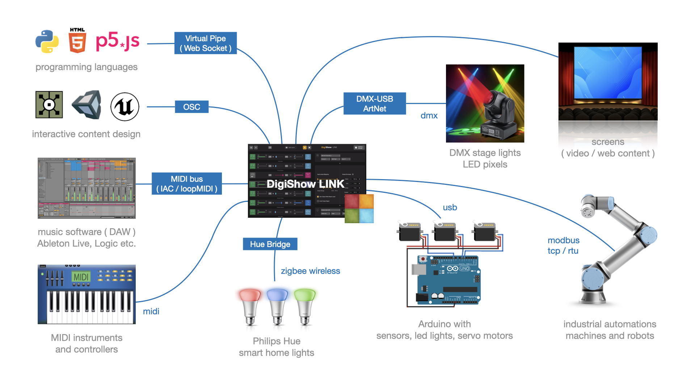
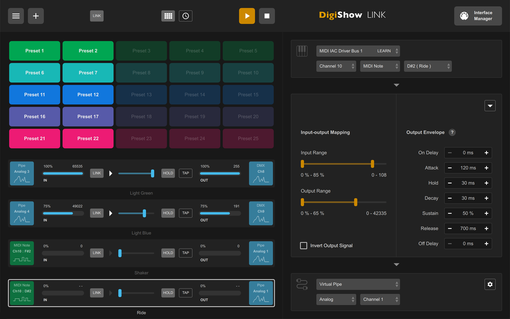
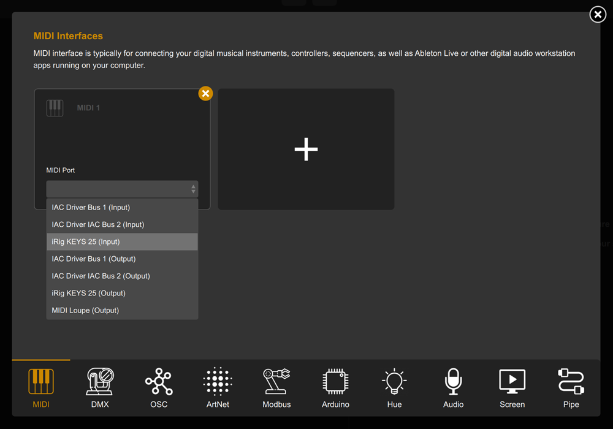
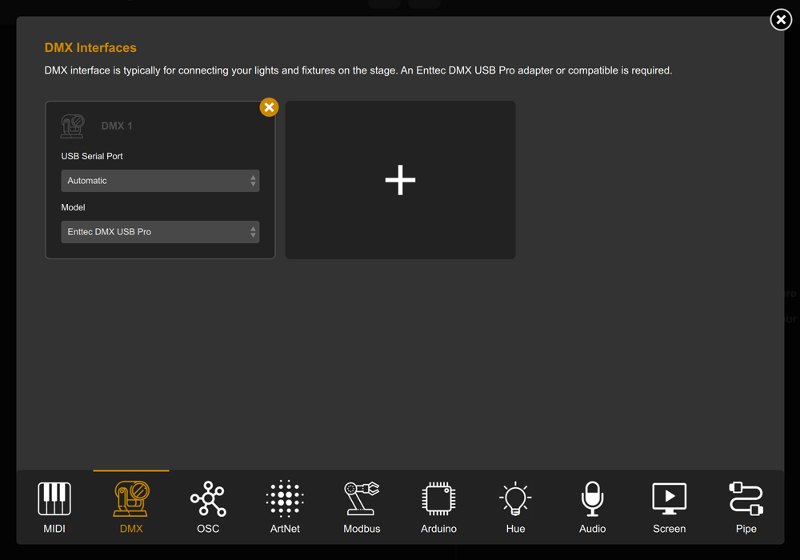
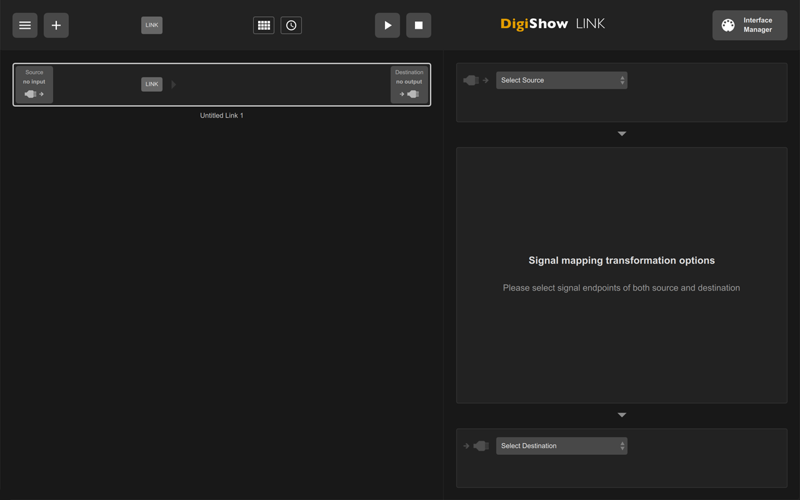
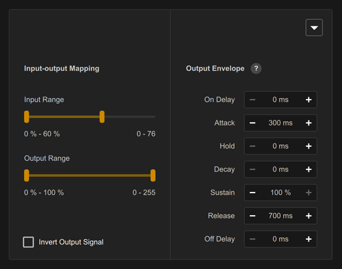

# DigiShow LINK

DigiShow is an easy-to-use software aims at controls for live performances and interactive shows with music, lights, displays, machines, robots and more digital things. It's a controller, console and smart gateway enables signal transferring between MIDI, DMX, OSC, ArtNet, Modbus, Arduino, Philips Hue and more interfaces.

With using DigiShow LINK app, there are some scenarios assumed: 

**Producers:** 
For live music or theatre performances, DJ or producers can arrange show lighting cues and stage automations on MIDI tracks alongside the music tracks in Ableton Live or other DAW. At the show, press the button on the Launchpad, the music loop and lighting effects will be instantly played in sync. 

**Performers:** 
When playing MIDI instruments like drums or keyboards, DigiShow can trigger dynamic lighting changes and even robotic movements by MIDI notes following the beat or the music. Sensors can also be added to acoustic or DIY instruments to automatically generate MIDI notes.

**Programmers:**
For building interactive art installations, often need develop apps that work with the hardware. DigiShow provides the service based on virtual pipe for the external user programs. Programmers can create their game or web apps to access the hardware easily through the service. 

**Makers and Hobbyists:**
DigiShow is for all show makers as well as hobbyists with little professional skills. Make digital shows for your own party time, or just make your house into a mini 'disneyland'.

Watch Video https://www.youtube.com/channel/UCmswlPRHZ5FhZIxTHJWqj7w  

## How does DigiShow work?

For a typical 'digital' show, requires some particular digital things working together, along with DigiShow LINK. 

DigiShow LINK app enables signal transferring between MIDI and other digital device interfaces like DMX, ArtNet, OSC, Modbus, Arduino, Philips Hue, as well as controls for media presentation on screens. 

MIDI notes and MIDI control changes are mapped and transformed to the signals for light, servo, media and more controls. Also, some input signals from sensors can be converted to MIDI notes or CC that will be able to be processed by other digital music software. 

DigiShow LINK works well with any music software that supports MIDI input/output, like Ableton Live, Logic Pro, FL Studio, etc. Light, media and other show cues can be flexibly arranged on MIDI tracks with notes and CC automation.

## Supported Interfaces

- **MIDI** interface is typically for connecting your digital musical instruments, controllers, sequencers and digital music apps.
- **DMX** interface is typically for connecting your lights and fixtures on the stage.
- **OSC** interface is typically for connecting your interactive media control and creation applications.
- **ArtNet** interface is typically for connecting your show lights through an IP network.
- **Modbus** interface is typically for connecting your industrial automations, robots and machines.
- **Arduino** is an open source electronic controller for making homebrew instruments, lights or gadgets for your interactive shows.
- **Philips Hue** is the popular smart home wireless-controlled lights.
- DigiShow can also control presenting videos, pictures and web contents with dynamic effects on multiple screens.  

## App Features

**Controller**  
DigiShow LINK app provides a simple user interface, with which you can easily configure the communication interfaces of various devices, and complete the patching of various input and output signals. 

**Console**  
The most basic user interface of the app looks like a standalone console, which can be used to adjust output signals instantly by moving faders and view input signal changes in real-time meters. 

**Gateway**  
The primary function designed in the app is a smart signal gateway that works with digital show facilities, it provides an efficient configuration method for signal mapping and conversion. Typically, DigiShow LINK runs on the computer as a service responsible for connecting devices, and manages show content and executes show logic in another separate software running in parallel. The show is completed in cooperation of both. 

## Release Downloads

Please visit https://github.com/robinz-labs/digishow/releases/latest to download the latest releases:  
- DigiShow LINK for macOS (64bit)
- DigiShow LINK for windows (64bit)

Go to the page, where choose digishow_mac_x.x.x.zip or digishow_win_x.x.x.zip in Assets list to download.  

## Install and Run

Download and unzip the latest release file.  

macOS:  
Copy app "DigiShow" to your Applications folder and run it.  

Windows:  
Copy folder "DigiShow LINK" to your disk and run "DigiShow.exe" in the folder.  
For some Windows version, also must run Extra\vc_redist.x64.exe to install Visual C++ 2015 Redistributable to your windows system.  

## Extra Downloads and Resources

**MIDI** virtual MIDI bus drivers (IAC / loopMIDI)  
In order to communicate with MIDI messages between DigiShow LINK and other software, users just need to setup a virtual MIDI bus in the operation system.  
[learn IAC for Mac](https://help.ableton.com/hc/en-us/articles/209774225-How-to-setup-a-virtual-MIDI-bus)  
[download loopMIDI for Windows](http://www.tobias-erichsen.de/software/loopmidi.html)  

**DMX** ENTTEC DMX USB Pro driver (FTDI VCP)  
Required to enable DigiShow LINK to control DMX lightings through an ENTTEC adapter.  
[download](https://www.ftdichip.com/Drivers/VCP.htm) 

**Arduino** sketch for Arduino remote IO controls  
Required to enable DigiShow LINK to configure and control IO on your Arduino units remotely.  
[download](https://github.com/robinz-labs/rioc-arduino/releases) 

**Screen** K-Lite Codec Pack (for windows)  
Required to enable DigiShow LINK to play MP4, MOV video files on your Windows computer.  
[download](https://www.codecguide.com/download_kl.htm) 

## Get Started with DigiShow

1. Let's try to use DigiShow for the first time. Connect a MIDI keyboard and an ENTTEC DMX USB Pro adapter to the USB ports of your computer. ENTTEC adapter is used to connect DMX lights. 

2. Open the DigiShow LINK app, and click the 'Interface Manager' button in the upper right corner of the window. 

Select the MIDI item, click the + button to create a new interface section labeled 'MIDI 1', where select your MIDI keyboard model. 

Select the DMX tab item and click the + button to create a new interface section labeled 'DMX 1'. Close the Interface Manager dialog when finished all. 

3. Now let's try to create a signal link to connect your MIDI keyboard input with the DMX light output, click the + button in the upper left corner of the window, a blank link item will be added to the left list. Alongside, you need to set the input source, output destination and mapping transformation parameters for the signal link on the right. 

4. Click the 'Select Source' drop-down menu, select your MIDI keyboard in it, and set the input parameters to 'Channel 1' 'MIDI Note' 'C3', and click the Apply button. 

Click the 'Select Destination' drop-down menu, select DMX in it, set the output parameter to 'Channel 1', and click the Apply button. 

5. Click the ▶︎ button in top bar to start the signal link session. At this point, when you press C3 (Middle C) on the MIDI keyboard, the lighting changes in DMX channel 1 will be trigged synchronously. 

6. Modify the settings in 'Input-out Mapping' and 'Output Envelope' to change the effect of the mapping transformation in real time. For example, setting 'Attack' to 300ms and 'Release' to 700ms makes the lighting fade in and out. 

7. And, add more signal links in this way. 

 
## Developer Resources

DigiShow is open-source. If you would like to rebuild this software using the source code we contributed, please visit https://github.com/robinz-labs/ . 

Please use qmake tool or QtCreator app to build executables from the source code, and confirm these library dependencies are required: 
- Qt 5.12 or higher http://www.qt.io
- RtMidi 4.0.0 http://www.music.mcgill.ca/~gary/rtmidi/
- OSC library for C++ using Qt https://github.com/MugenSAS/osc-cpp-qt
- TinyOSC library https://github.com/mhroth/tinyosc
- Ableton Link library https://ableton.github.io/link/
- global hotkey library https://github.com/Skycoder42/QHotkey

The source code can be compiled for target platforms compatible with: 
- macOS 10.13 or higher
- windows 7, windows 10 or higher ( 64-bit version recommended )
- linux ( see the websites of Qt and other dependent libraries for compatibility details )
